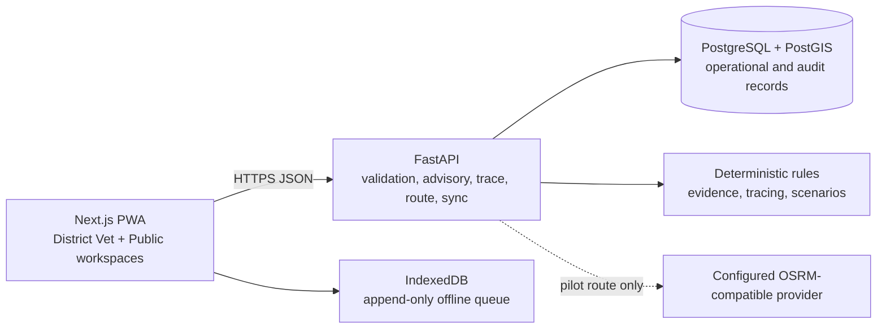

# Jeev Rekha

**Explainable livestock-movement decision support for outbreak-aware veterinary operations.**

[Live app](https://jeev-rekha.vercel.app/) · [API readiness](https://jeev-rekha-api-aryan.onrender.com/api/v1/readiness) · [Repository](https://github.com/4ryxn/Jeev-Rekha)

Jeev Rekha helps veterinary teams and animal-movement operators understand whether a proposed livestock movement has enough recorded evidence to proceed with confidence, needs precautionary review, or requires authorised veterinary guidance.

## The problem

Livestock disease and zoonotic outbreak response depends on understanding how animals, vehicles, markets, checkposts, and locations connect over time. A reported outbreak alone does not give a transporter or veterinary officer a clear, accountable movement decision. Missing evidence can be as important as known exposure.

Jeev Rekha uses transparent, deterministic rules and persisted operational records to make those relationships visible without presenting an advisory as a permit, restriction, or disease confirmation.

## What it does

### Detect → Decide → Trace → Contain → Review

- **Detect** — record and view suspected, confirmed, and closed outbreak evidence alongside location and verification context.
- **Decide** — evaluate livestock consignments as **Green, Amber, Red, or Grey**, with reasons, a recommended next action, and an Evidence Coverage Score.
- **Trace** — run persisted, disease-window-aware Rewind and Fast-forward contact traces from confirmed outbreaks.
- **Contain** — compare transparent, persisted containment-response scenarios and print an operational action brief.
- **Review** — organise evidence gaps, sync exceptions, and trace contacts in a non-overwriting Review Queue with printable report sources.

## Implemented capabilities

### District Vet Team workspace

- Dashboard with source-aware operational context, advisories, trace activity, containment activity, and review links.
- Outbreak-evidence and consignment registration workflows, including validation and append-only offline queue support.
- Map & Advisories with a controlled synthetic movement network for demo data and source-aware advisory navigation.
- Deterministic Safe Corridor assessment for synthetic consignments, kept separate from the advisory decision.
- Trace Lab with persisted Rewind/Fast-forward results, timelines, linked contacts, and veterinary-review language.
- Containment Scenario Lab with auditable workload assumptions and browser-printable action briefs.
- Review Queue and browser-printable advisory, trace, and containment reports.

### Animal Owner / Trader workspace

- A separate, bilingual English/Hindi **Pre-Travel Animal Movement Check** for animal owners, buyers, sellers, and transporters.
- A no-write, advisory-only check using the controlled demo data context.
- Plain-language result, evidence/information coverage wording, and a printable advisory slip.

### Explainability and evidence

- Four explicit advisory states: **Green** (lower risk with sufficient evidence), **Amber** (precautionary review), **Red** (veterinary review required), and **Grey** (insufficient evidence).
- Visible reasons, recommended next action, Evidence Coverage Score, and factor-level evidence for advisory decisions.
- Pilot-entered advisory evidence that records rule-engine version, route state, vaccination evidence, review areas considered, and an auditable policy snapshot.

### Offline-safe registration

- Installable PWA shell and an IndexedDB queue for consignment and outbreak registration.
- Pending, syncing, synced, needs-review, and failed states are visible to the operator.
- Sync uses client operation IDs and server receipts to prevent duplicate writes; queued records are never silently reclassified or overwritten.

### Demo and Pilot modes

- **Demo data**: controlled fictional SIH records, shown through the Synthetic Movement Network.
- **Pilot records**: manually entered local locations, operations records, optional review radii, and a Leaflet-based geographic view using only persisted pilot coordinates.
- **All records**: source badges and context labels prevent silent mixing of Demo and Pilot records.
- Pilot road-route display uses a configured OSRM-compatible provider only when available; otherwise the application states that no navigation recommendation is shown.

## Technology stack

| Layer | Implementation |
| --- | --- |
| Web | Next.js App Router, React, TypeScript, Tailwind CSS |
| PWA/offline capture | Service Worker and IndexedDB via Dexie |
| Mapping | MapLibre GL JS for optional background enhancement; Leaflet for Pilot Geographic View; reliable SVG synthetic-network visual |
| API | FastAPI, Pydantic, Pydantic Settings, Uvicorn |
| Data | PostgreSQL + PostGIS, SQLAlchemy, Alembic, GeoAlchemy2 |
| HTTP/routing adapter | HTTPX with a configured OSRM-compatible provider adapter |
| Testing | Pytest and FastAPI TestClient |
| Local infrastructure | Docker Compose with PostGIS |

## Architecture



## Local setup

### Prerequisites

- Node.js 20.9+ and npm
- Python 3.12
- Docker Desktop with Docker Compose

### 1. Configure local environment files

```bash
cp .env.example .env
cp apps/api/.env.example apps/api/.env
cp apps/web/.env.local.example apps/web/.env.local
```

The committed values are local-development examples. Do not commit database credentials or production environment values.

### 2. Start PostGIS

```bash
docker compose up -d
docker compose ps
```

### 3. Start the API and prepare controlled demo data

```bash
cd apps/api
python3.12 -m venv .venv
source .venv/bin/activate
python -m pip install -r requirements-dev.txt
python -m app.demo_reset
uvicorn app.main:app --reload --port 8000
```

In another terminal:

```bash
curl http://localhost:8000/api/v1/health
curl http://localhost:8000/api/v1/readiness
```

`python -m app.demo_reset` migrates to the current schema and idempotently adds controlled fictional demo records. It does not delete existing records.

### 4. Start the web app

```bash
cd apps/web
npm install
npm run dev
```

Open [http://localhost:3000](http://localhost:3000).

## Deployment summary

The recommended layout is:

- **Frontend** — Vercel, rooted at `apps/web`.
- **API** — Render web service using [`apps/api/Dockerfile`](apps/api/Dockerfile).
- **Database** — Render PostgreSQL with PostGIS enabled and verified.

Migrations are an explicit release step; the API container never migrates or seeds on startup. Synthetic seeding is an optional, manual action for a controlled demo environment only. See the [deployment guide](docs/04-deployment.md) for environment variables, release commands, CORS setup, and routing/tile-provider limitations.

## Testing and quality checks

Run the backend suite against the local PostGIS instance:

```bash
cd apps/api
source .venv/bin/activate
pytest -q
```

Run frontend checks:

```bash
cd apps/web
npm run lint
npm run build
```

Run non-destructive API smoke checks against a running service:

```bash
cd apps/api
source .venv/bin/activate
python -m app.smoke_test
```

Verified in this repository: **55 backend tests pass**; frontend lint completes with **zero ESLint warnings/errors**; and the Next.js production build succeeds. The production API Docker image has also been built and verified to import `app.main` using a conventional `postgresql://` database URL.

## Data, privacy, and safety boundaries

- Demo records are fictional/synthetic. Pilot locations and Pilot records are manually entered by local operations staff.
- Jeev Rekha has no live INAPH, NADRES, IDSP, Pashu Aadhaar, LGD, or other government-system integration.
- An advisory is **not** a movement permit, legal restriction, disease confirmation, automated enforcement action, or government order.
- **Grey means evidence is insufficient; it never means safe.**
- Trace findings identify contacts for veterinary review; they do not confirm disease transmission or assign blame.
- Review radii and pilot route information require authorised veterinary validation and are not official containment orders.
- Authorised veterinary officials make final operational decisions.

## Documentation

- [Deployment guide](docs/04-deployment.md)
- [Five-minute judge-demo runbook](docs/05-judge-demo-runbook.md)
- [Product requirements](docs/01-product-requirements.md)
- [UI/UX design system](docs/02-ui-ux-design.md)
- [Technical architecture](docs/03-tech-stack.md)
